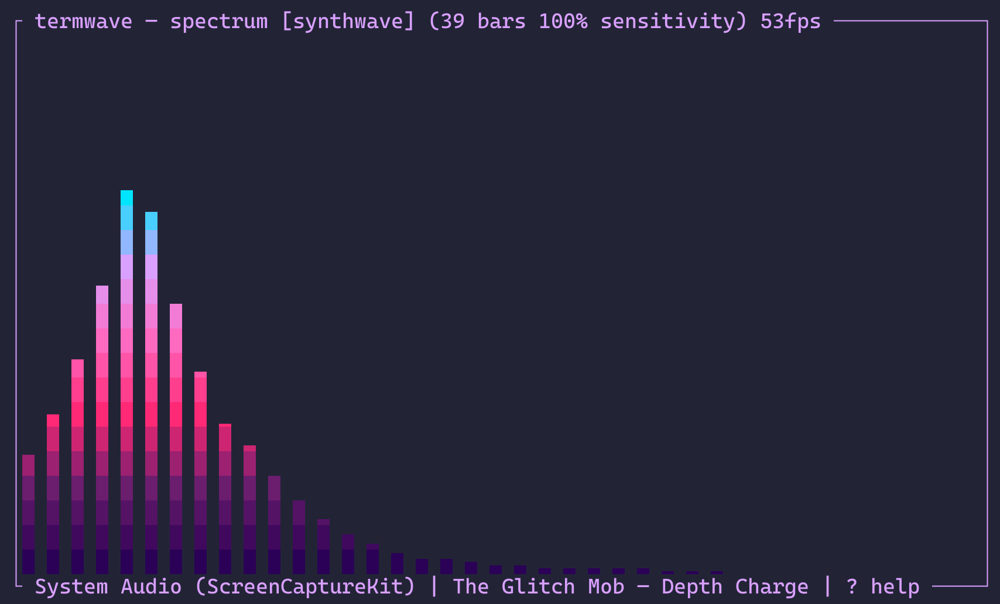
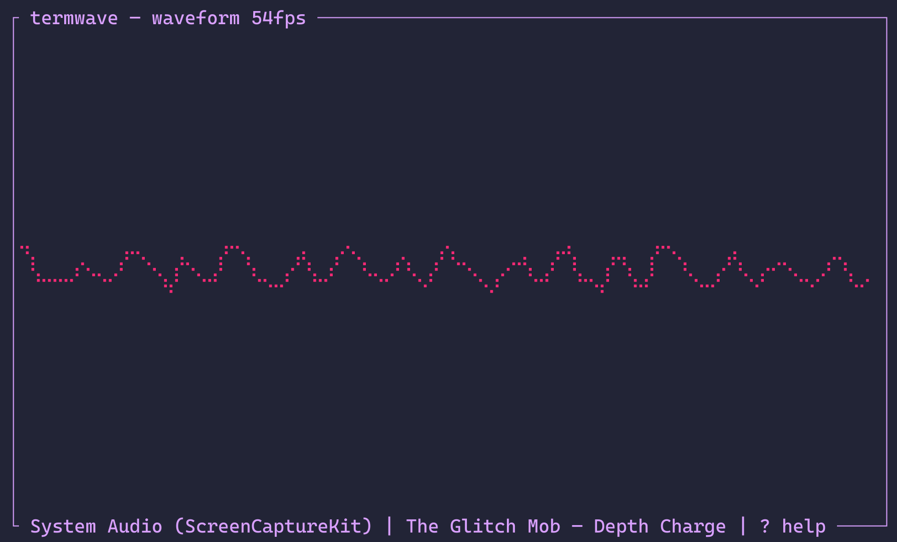
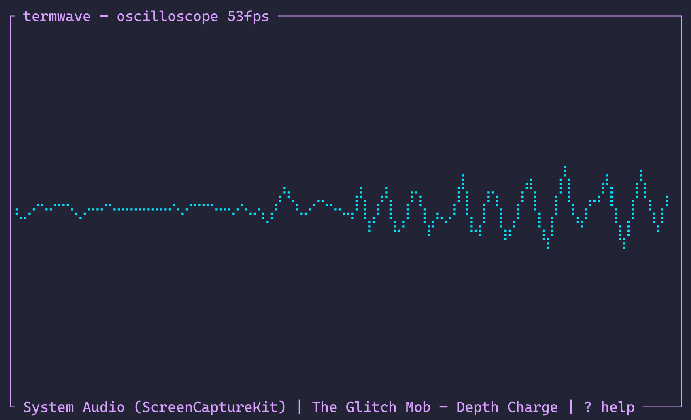
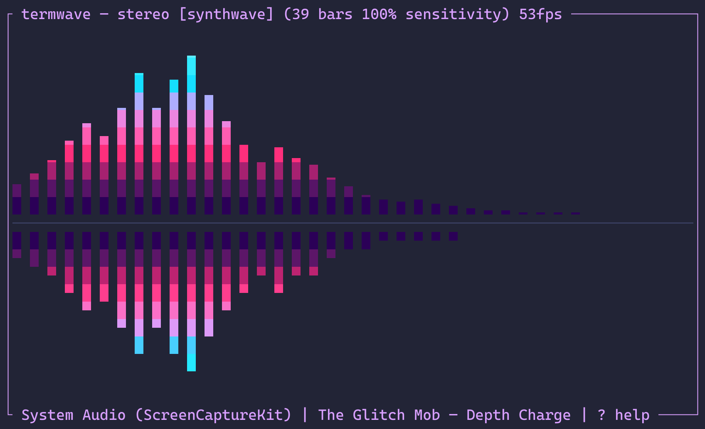

# specterm

[](https://www.rust-lang.org/)
[](https://swift.org/)
[](https://www.apple.com/macos/)

Terminal audio visualizer for macOS. Renders real-time spectrum bars, waveforms, oscilloscopes, and stereo visualizations from mic input or system audio.

| | |
|---|---|
|  |  |
|  |  |

## Install

Requires Rust and (optionally) Swift for system audio capture.

```fish
just install
```

This builds and installs `specterm` and `specterm-tap` to `~/.cargo/bin`.

Maintainers can use `just package <version>` to build an ad-hoc-signed DMG for
local packaging validation. Public releases are Developer ID-signed and
notarized by the tag-driven GitHub Actions workflow; see `RELEASING.md`.

## Usage

```
specterm                        # spectrum visualizer (system audio by default)
specterm --mode wave            # waveform mode
specterm --mode scope           # oscilloscope mode
specterm --mode stereo          # stereo L/R visualization
specterm --device "system"      # capture system audio (requires specterm-tap)
specterm --theme ~/.config/themes/fire.toml  # use an explicit theme file
specterm --bars 128             # set number of spectrum bars
specterm --list-devices         # list available audio devices
```

## Keybindings

| Key | Action |
|-----|--------|
| `?` | Help |
| `m` | Cycle visualization mode |
| `d` | Select audio device |
| `s` | Settings (theme, smoothing, noise, etc.) |
| `Up` / `Down` | Increase / decrease sensitivity |
| `Right` / `Left` | More / fewer bars |
| `q` / `Esc` | Quit |

## Modes

- **spectrum** — frequency bars with color gradient and gravity fall-off
- **wave** — real-time waveform amplitude plot
- **scope** — oscilloscope with zero-crossing trigger
- **stereo** — left channel bars up, right channel bars down from center

## Themes

Specterm reads explicit `theme` and `theme_catalog` paths from
`~/.config/specterm/config.toml`. The selected file is loaded directly; the
catalog's `themes = [...]` array supplies the settings picker. Specterm never
scans a theme directory. Palettes without a `[visualizer]` section receive a
gradient from their semantic color range automatically.

## Settings

Press `s` to open the settings overlay (visualizer keeps running behind it). Adjust with arrow keys or vim bindings:

- **Theme** — cycle through color themes with live preview
- **Smoothing** — temporal smoothing between frames (0.0–0.99)
- **Monstercat** — smooth envelope connecting bar tops
- **Noise floor** — threshold to zero out quiet bars
- **Gradient mode** — color by amplitude or by bar position
- **Bar width** — width of each bar in columns (1–8)
- **Bar spacing** — gap between bars (0–4)
- **Sensitivity** — manual gain adjustment (10–500%)

Theme changes in the settings picker always apply to the current session only and never rewrite `config.toml`. The `--save` flag and `save_settings = true` can persist other in-app settings, but they never replace the configured `theme`; edit that path directly to change the startup theme.

## System audio capture

To visualize audio from Apple Music or other apps, specterm uses a companion Swift binary (`specterm-tap`) that captures system audio via ScreenCaptureKit.

**Requirements:**
- macOS 13+
- Screen Recording permission must be granted to your terminal app (System Settings > Privacy & Security > Screen Recording)

Select "System Audio (ScreenCaptureKit)" from the device menu (`d`), or pass `--device system`.

**Alternative:** Install [BlackHole](https://github.com/ExistentialAudio/BlackHole), create a Multi-Output Device in Audio MIDI Setup (speakers + BlackHole), set it as your output, then select "BlackHole 2ch" as the input device.
